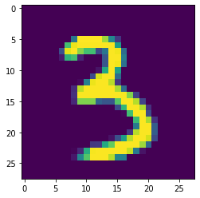
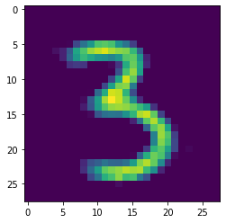
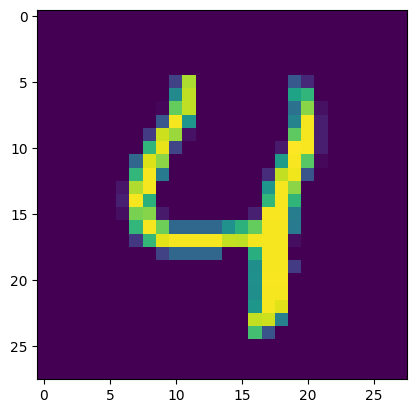
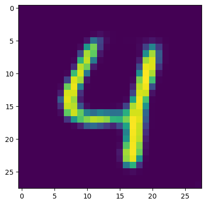
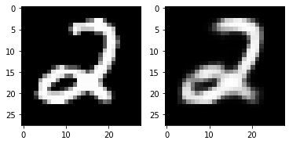

Learn Pytorch, from noob to ninja!

<!--  -->

## Contents
1. [learn_fn](#learn_fn)
2. [base](#base)
3. [CNN](#cnn)
4. [RNN2](#rnn2)
5. [Autoencoder](#autoencoder)
6. [vae](#vae)
7. [GAN](#gan)
8. [gpt2_archive_uci](#gpt2_archive_uci)
<!-- 4. [Fourth Example](#fourth-examplehttpwwwfourthexamplecom) -->

## learn_fn
basic feed forward neural network 
learn a algebriac function 
nn as function approximators. backprop loss, optimizer step
#### [Open `base.ipynb` in Google Colab](https://colab.research.google.com/github/eisbetterthanpi/pytorch/blob/master/base.ipynb)

## base
basic feed forward neural network 
classifying FashionMNIST dataset 
flatten image before passing to model with nn.Sequential linear layers
#### [Open `base.ipynb` in Google Colab](https://colab.research.google.com/github/eisbetterthanpi/pytorch/blob/master/base.ipynb)

## CNN
basic convolutional neural network 
classifying CIFAR10 dataset 
model with nn.Conv2d and nn.MaxPool2d followed by a flattened Linear layer
pure convolution
#### [Open `CNN.ipynb` in Google Colab](https://colab.research.google.com/github/eisbetterthanpi/pytorch/blob/master/CNN.ipynb)

## RNN2
recurrent neural network

#### [Open `RNN2.ipynb` in Google Colab](https://colab.research.google.com/github/eisbetterthanpi/pytorch/blob/master/RNN2.ipynb)

## Autoencoder
learn to recreate mnist image 
learning rate schedulers(very important!) 
#### [Open `Autoencoder.ipynb` in Google Colab](https://colab.research.google.com/github/eisbetterthanpi/pytorch/blob/master/Autoencoder.ipynb)

  
&nbsp;

   
   
  
original | reconstructed 

## Convolutional Autoencoder
learn to recreate mnist image using convolutional autoencoder 
model size is significantly smaller than the naive MLP autoencoder 
#### [Open `conv_autoencoder.ipynb` in Google Colab](https://colab.research.google.com/github/eisbetterthanpi/pytorch/blob/master/conv_autoencoder.ipynb)

  
&nbsp;

   
   
   
  
original | conv transpose | conv upsample 

two ways of doing deconvolution: nn.ConvTranspose2d and nn.Upsample

## vae
variational autoencoder
#### [Open `vae.ipynb` in Google Colab](https://colab.research.google.com/github/eisbetterthanpi/pytorch/blob/master/vae.ipynb)

  
&nbsp;

  
  
original | reconstructed 

<!-- 
[Paper](https://arxiv.org/abs/2312.01479) |
[Website](https://research.myshell.ai/open-voice) 
[Video](https://github.com/myshell-ai/OpenVoice/assets/40556743/3cba936f-82bf-476c-9e52-09f0f417bb2f)
 -->

## GAN
Generative Adversarial Network (GAN)
training and generating emojis
#### [Open `dcgan.ipynb` in Google Colab](https://colab.research.google.com/github/eisbetterthanpi/pytorch/blob/master/dcgan.ipynb)

## gpt2_archive_uci
fine tuning pretrained huggingface gpt2 for text classification
#### [Open `gpt2_archive_uci.ipynb` in Google Colab](https://colab.research.google.com/github/eisbetterthanpi/pytorch/blob/master/gpt2_archive_uci.ipynb)

<!--  -->

If you find this code useful, please credit `eisbetterthanpi`
<!-- [website](https://github.com/eisbetterthanpi) -->
[website]: https://github.com/eisbetterthanpi

